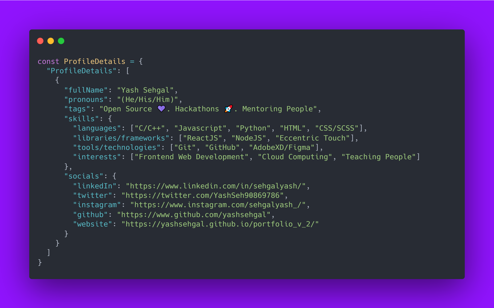

## Hey Folks :wave: Hope you are doing great :rocket:

Welcome to my GitHub Profile, It's great to see you people :)

  

Let's talk a bit about myself, as this is my profile. I am Yash Sehgal and computer science undergrad pursuing engineering from [Medicaps University](https://medicaps.ac.in), Indore (India). I love to contribute to Open Source projects and mentor folks for the same. I am an active be at Hackathons both as a participant and mentor. In my free time, I love to interact with the folks in teams and communities.

- I have been to many Open Source Programs such as DWoC, GSSoC, LGMSoC and Hacktoberfest
- Also, I have been a part of various tech communities in my college such as [@Codechef Medicaps Chapter](https://www.instagram.com/codechef_medicaps_chapter/) and [@ACM Medicaps Chapter](http://medicaps.hosting.acm.org/)
- I am also maintaining projects under organizations such as [The DesignSystems(@DesignSystemsOSS)](https://www.github.com/DesignSystemsOSS) and [@MUACM](https://www.github.com/muacm)
- I have been managing various projects related to frontend tools and libraries under [The DesignSystems(@DesignSystemsOSS) Organization]() as the Founding Creator and Lead Developer.
- Check out [Eccentric Touch](https://www.github.com/DesignSystemsOSS/eccentrictouch) and [GetButtons.io](https://www.github.com/DesignSystemsOSS/getbuttons.io) (Projects under DesignSystemsOSS)
- If you're interested in contributing to our projects and collaborate with community members then join our [Discord Server](https://discord.gg/GpHBdA68fg)

*Let's connect with each other and collaborate to add more value in the community.*

### My Socials are listed below

  [LinkedIn](https://www.linkedin.com/in/sehgalyash/) &bullet;
  [Twitter](https://twitter.com/YashSeh90869786) &bullet;
  [GitHub Memory](https://githubmemory.com/@yashsehgal) &bullet;
  [Instagram](https://www.instagram.com/sehgalyash_/) &bullet;
  [Website / Portfolio](https://yashsehgal.github.io/portfolio_v_2/) &bullet;
  [Dev.to @yashsehgal](https://dev.to/yashsehgal) &bullet;
  [YouTube](https://www.youtube.com/channel/UC23yA3SBkV_ehY4H8VSuNVg)

**My Contribution Status**

