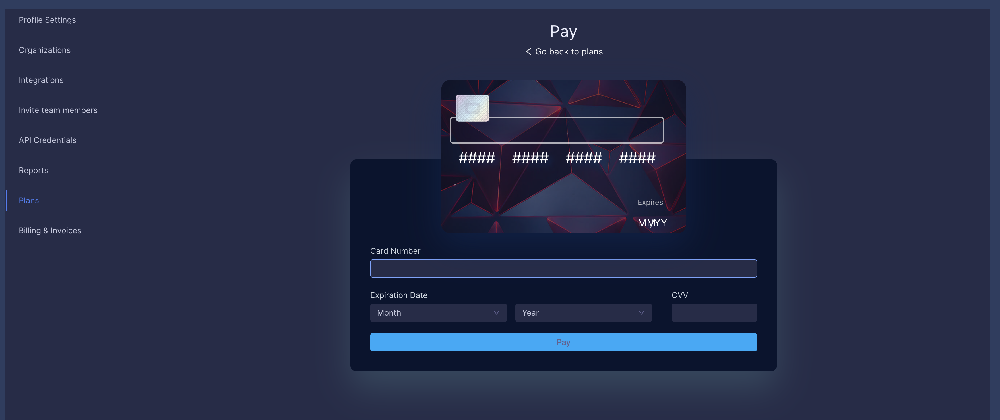
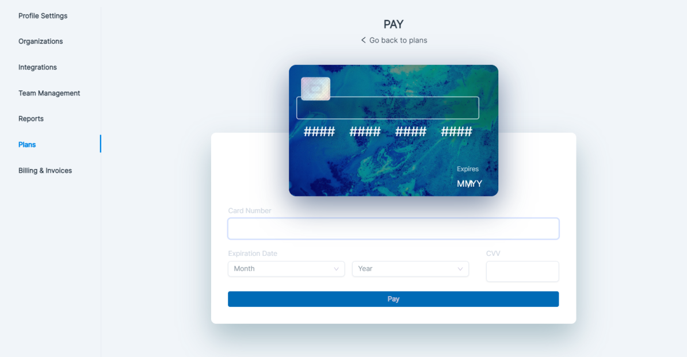
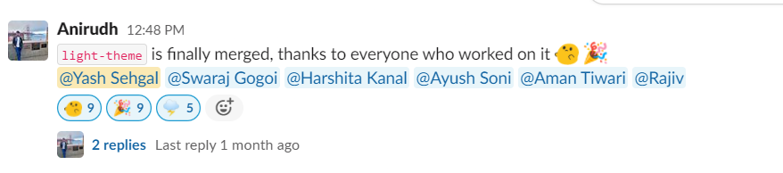

# Internship experience [@economize.cloud](https://economize.cloud)

Well, It's been a great experience working as a Frontend SDE Intern at economize.cloud. First of all, A special thanks to all my colleagues for helping me out at every point, with every task. They were there to help me, and the culture here is amazing 🔥

A Great thanks to [Anirudh](https://www.linkedin.com/in/manirudh/) for giving me this opportunity to work with a wonderful team.

## How it all started

In my initial sophomore year, I was looking for some front-end development intern roles and applied to a bunch of startups. Economize was one of them, the day I applied, immediately I got a response, stating that they're interested in my profile for the same role.

I and Anirudh had our first Google Meet, and we discussed each and everything, from UI development to Design Systems. The interview experience was great and very supportive.
After some days, they decided to have me on board.
And I was so happy at that time, as it's my first ever developer internship.

I joined them, the onboarding was very great. I was for the first time looking at a company's codebase.

## Things I worked on during this role

The frontend technology stack is on VueJS, SCSS, and the backend is on GoLang. Before this internship, I had a little experience with VueJS, although I was/am good at SCSS.

Initially, Things were very overwhelming for me, but as the team was supportive, I was not facing lots of issues and was able to work easily.

- **Converting the application into Light Theme**
Earlier, the UI of economize.cloud used to have a dark theme and also the design system as well. What I worked on is converting the entire design system to a light theme, things like cards, typographies, buttons, and many other complex components like Charts. Each and everything has to be converted to a light theme. It was a complex and time-taking task, but we did it. We converted the entire UI + Design System, from dark to light theme.

This is a small comparison of a screen in our application before & after theme transformation.

    

        <h4>Dark Theme (Before)</h4>
        
    

    

        <h4>Light Theme (After)</h4>
        
    

Including this, there were multiple screens and components which have to be modified. And I enjoyed working on this huge task.
And, of course, the day Light-Theme PR got merged 🎉🎉

- I have worked on the product's alignment features, created Base-Wrappers for components and design systems.
- Worked a lot with Tables and ant-design components.
- Worked on Login/Signup UI
- And a bunch of other fixes 🔥

## Things I have learned during my internship

### Soft Skills

- As a second-year student, managing time for a full-time internship. But somehow, I was able to manage my time to economize (thanks to online classes). I learned how to manage time for the company, personal health, and other things. This was initially not the case but later, with time I managed it.
- I learned how to professionally communicate with people from the company and outside the company. I started being more comfortable with explaining complex-technical issues/features in a simpler manner to others.

### Hard Skills

- For the first time in my entire life, I saw a code in GoLang (although, I didn't work on that) - I learned about backend terminologies and processes. How cloud techs are being utilized by the product. How 3 party tools and services are life-saving.
- I spent a lot of time understanding and creating a decent frontend codebase structure that can be scaled further with not many issues.
- I used many technologies and tools like Storybook, Chromatic, Docker, GitPod, ImageKit, Blisk, AWS, VueJS, and a bunch of other things.

The learning curve is always HIGH at economize 📈. 
I had the best 5 months so far. Looking forward to joining them full-time as well, as a TEAM!

It was lovely to document my first internship experience. 
That was from my side. 
*Have a great day ahead, Reader!*